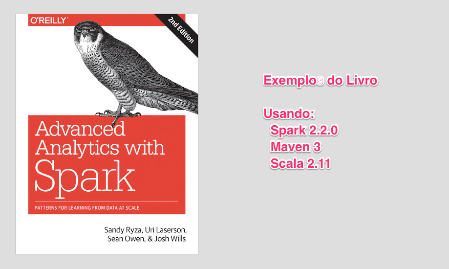

Advanced Analytics with Spark Source Code
=========================================



## Clonando o repositório

```bash
git clone git@github.com:joao-parana/aa-spark.git
```


## Fazendo o build


```bash
cd aa-spark
mvn -Drat.ignoreErrors=true \
    -Dcheckstyle.skip \
    -Dmaven.test.skip=true \
    -N clean install
```

Exemplo de build/run do capitulo 4 - Arvores de Decisão.

```bash
cd ch04-rdf 
mvn -Drat.ignoreErrors=true \
    -Dcheckstyle.skip \
    -Dmaven.test.skip=true \
    clean package
```

Executando o exmplo do capitulo 4 - Arvores de Decisão.

```bash
java -jar target/ch04-rdf-2.2.0-jar-with-dependencies.jar
```

Podemos alterar o arquivo JAR gerado para trocar o nivel de log do Spark de INFO para WARN

```bash
jar -xvf target/ch04-rdf-2.2.0-jar-with-dependencies.jar org/apache/spark/log4j-defaults.properties 
vi org/apache/spark/log4j-defaults.properties 
jar -uvf target/ch04-rdf-2.2.0-jar-with-dependencies.jar org/apache/spark/log4j-defaults.properties
```

## README original

Code to accompany [Advanced Analytics with Spark](http://shop.oreilly.com/product/0636920035091.do), by 
[Sandy Ryza](https://github.com/sryza), [Uri Laserson](https://github.com/laserson), 
[Sean Owen](https://github.com/srowen), and [Josh Wills](https://github.com/jwills).


[Para comprar veja esse link](http://shop.oreilly.com/product/0636920056591.do)

### 2nd Edition (current)

The source to accompany the 2nd edition is found in this, the default 
[`master` branch](https://github.com/sryza/aas).

### 1st Edition

The source to accompany the 1st edition may be found in the 
[`1st-edition` branch](https://github.com/sryza/aas/tree/1st-edition).

### Build

[Apache Maven](http://maven.apache.org/) 3.2.5+ and Java 8+ are required to build. From the root level of the project, 
run `mvn package` to compile artifacts into `target/` subdirectories beneath each chapter's directory.

### Data Sets

- Chapter 2: https://archive.ics.uci.edu/ml/machine-learning-databases/00210/
- Chapter 3: http://www-etud.iro.umontreal.ca/~bergstrj/audioscrobbler_data.html
- Chapter 4: https://archive.ics.uci.edu/ml/machine-learning-databases/covtype/
- Chapter 5: https://kdd.ics.uci.edu/databases/kddcup99/kddcup99.html (do _not_ use http://www.sigkdd.org/kdd-cup-1999-computer-network-intrusion-detection as the copy has a corrupted line)
- Chapter 6: https://dumps.wikimedia.org/enwiki/latest/enwiki-latest-pages-articles-multistream.xml.bz2
- Chapter 7: ftp://ftp.nlm.nih.gov/nlmdata/sample/medline/ (`*.gz`)
- Chapter 8: http://www.andresmh.com/nyctaxitrips/
- Chapter 9: (see `ch09-risk/data/download-all-symbols.sh` script)
- Chapter 10: ftp://ftp.ncbi.nih.gov/1000genomes/ftp/phase3/data/HG00103/alignment/HG00103.mapped.ILLUMINA.bwa.GBR.low_coverage.20120522.bam
- Chapter 11: https://github.com/thunder-project/thunder/tree/v0.4.1/python/thunder/utils/data/fish/tif-stack

